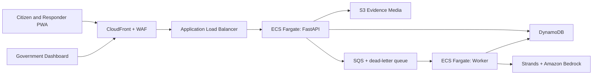

# ReliefOS

**Open-source, AI-assisted disaster reporting and rescue coordination on AWS.**

[](https://www.linkedin.com/in/chandrachoodraveendran)
[](https://chandrachood.in)
[](LICENSE)

> [!WARNING]
> ReliefOS is an alpha MVP, not certified emergency infrastructure. Do not use it as a replacement
> for official emergency numbers or deploy it for real incidents without government ownership,
> security review, field testing, trained operators, and an approved incident-response procedure.

ReliefOS converts citizen reports into traceable rescue cases. Affected people can report a
situation with GPS and media, families can search privacy-safe person records, verified responders
can receive missions, and government coordinators can prioritize and assign cases. Deterministic
life-safety rules operate without AI. An optional Strands agent on Amazon Bedrock adds structured
triage recommendations but cannot dispatch, reject, close, identify, or reduce priority.

## What the MVP includes

- Mobile-first, installable Progressive Web App with offline report queue.
- Emergency case creation with GPS, danger indicators, required assistance, and case access token.
- Idempotent submissions: a poor-network retry returns the original case instead of duplicating it.
- Deterministic P0-P4 safety triage that never depends on a model.
- Optional asynchronous Strands and Amazon Bedrock triage enrichment.
- S3 presigned photo, video, and audio uploads; bounded local uploads for development.
- Privacy-safe missing/safe person registration and search.
- Responder registration, approval, availability, assignment, and mission updates.
- Government shelter registration and proximity search.
- Government operations list and map.
- Local-memory and DynamoDB storage adapters.
- SQS background worker, ECS Fargate container, AWS CDK infrastructure, and CI checks.

## Safety boundaries

ReliefOS intentionally does **not**:

- Autonomously dispatch a responder, drone, boat, helicopter, or airlift.
- Treat AI-generated-media detection as proof of authenticity.
- Allow a public reporter to verify death or identity.
- Display sensitive recovery evidence in public person search.
- Claim that a map route is physically safe during a disaster.
- Wait for Bedrock before returning a durable case ID.

## Architecture



The API and worker use the same image with different startup commands. Case creation is a short,
synchronous operation. Media processing and AI run asynchronously. DynamoDB is feasible for
operational state; it does not have native radius search, so the MVP stores coarse geographic
cells and calculates shelter distance in application code. A production system with complex
geospatial queries can add OpenSearch or PostGIS while retaining DynamoDB as the case store.

## Run locally

Requirements: Python 3.11 or newer.

```bash
python -m venv .venv
source .venv/bin/activate              # Windows: .venv\Scripts\activate
python -m pip install -e ".[dev]"
cp .env.example .env
uvicorn app.main:app --reload
```

Open:

- Portal: <http://localhost:8000/portal/>
- OpenAPI documentation: <http://localhost:8000/docs>
- Health: <http://localhost:8000/health/ready>

The default uses in-memory storage and development-only role headers. It makes no AWS calls.

### Create a case with curl

```bash
curl -X POST http://localhost:8000/v1/cases \
  -H "Content-Type: application/json" \
  -H "X-Actor-ID: demo-citizen" \
  -H "X-Actor-Role: citizen" \
  -H "Idempotency-Key: demo-report-0001" \
  -d '{
    "case_type": "trapped",
    "description": "Three people are trapped and water is rising",
    "affected_people_count": 3,
    "latitude": 10.7867,
    "longitude": 76.6548,
    "danger_indicators": ["rising_water", "people_trapped"],
    "requested_assistance": ["rescue", "boat"]
  }'
```

Keep the returned `access_token`; it permits the reporter to retrieve that case without exposing
it publicly.

## Test and check the project

```bash
make check
```

Or run the commands separately:

```bash
ruff check app tests scripts infrastructure
ruff format --check app tests scripts infrastructure
mypy app
pytest --cov=app --cov-report=term-missing
```

## Run with Docker

```bash
docker compose up --build
```

This starts the FastAPI application at <http://localhost:8000>. The default compose profile uses
in-memory storage so it remains easy to evaluate.

## Use DynamoDB Local

```bash
docker compose --profile dynamodb up -d dynamodb
export STORAGE_BACKEND=dynamodb
export DYNAMODB_ENDPOINT_URL=http://localhost:8001
python scripts/create_local_tables.py
uvicorn app.main:app --reload
```

For containers, set `DYNAMODB_ENDPOINT_URL=http://dynamodb:8000`.

## Enable Strands and Amazon Bedrock

Deterministic triage remains active whether the model is enabled or not. To add asynchronous AI
enrichment, configure AWS credentials with permission to invoke the chosen Bedrock model and set:

```bash
AI_TRIAGE_ENABLED=true
BEDROCK_MODEL_ID=<a Bedrock model or inference profile available in your Region>
CASE_QUEUE_URL=<SQS queue URL>
STORAGE_BACKEND=dynamodb
```

Then start the worker:

```bash
python -m app.worker
```

Strands runs inside the worker process. Its output is validated against a Pydantic schema. The
merge policy accepts an AI escalation but never an AI downgrade of the stored priority.

## Authentication modes

`AUTH_MODE=local` reads `X-Actor-ID` and `X-Actor-Role`. It is for local development only and is
forbidden when `APP_ENV=production`.

`AUTH_MODE=cognito` verifies the JWT signature, issuer, token use, app client, expiry, and Cognito
groups. Configure:

```bash
AUTH_MODE=cognito
COGNITO_USER_POOL_ID=<pool-id>
COGNITO_APP_CLIENT_ID=<client-id>
```

Supported Cognito group names are `citizen`, `responder`, `medical`, `shelter_operator`,
`coordinator`, and `recovery_officer`.

The included web UI uses local headers for the open-source demonstration. Before a real cloud
deployment, connect it to the Cognito authorization-code flow and remove the local operations-role
shortcut.

## Deploy the AWS foundation

The CDK stack creates the VPC, ALB, ECS API and worker services, ECR-backed image asset, DynamoDB
tables, S3 evidence bucket, SQS queue and dead-letter queue, Cognito user pool, CloudFront
distribution, and baseline IAM permissions. AWS WAF is deliberately a production configuration
step because a CloudFront web ACL must be deployed in `us-east-1` and its managed rules and rate
limits must match the operating authority's expected traffic.

```bash
cd infrastructure
python -m venv .venv
source .venv/bin/activate
pip install -r requirements.txt
cdk bootstrap
cdk synth
cdk deploy
```

The default CDK deployment is a **demonstration environment**, not production. Review costs,
configure Cognito sign-in, add the WAF web ACL, use a production secret, establish backup and
retention policies, and complete the controls in [`docs/production-readiness.md`](docs/production-readiness.md).
For complete specifications, see the [Product Requirements Document (PRD)](docs/PRD.md).

## Repository structure

```text
app/             FastAPI, domain models, safety rules, repositories, AWS adapters, worker
web/             Mobile-first PWA and operations dashboard
tests/           Unit and API workflow tests
infrastructure/  AWS CDK deployment
scripts/         Local development helpers
docs/            PRD, Architecture, and production-readiness notes
```

## Creator & Maintainer

**Chandrachood Raveendran**

- **Website:** [chandrachood.in](https://chandrachood.in)
- **LinkedIn:** [linkedin.com/in/chandrachoodraveendran](https://www.linkedin.com/in/chandrachoodraveendran)
- **GitHub:** [@chandrachood](https://github.com/chandrachood)

## Open-source contribution

Read [`CONTRIBUTING.md`](CONTRIBUTING.md), [`CODE_OF_CONDUCT.md`](CODE_OF_CONDUCT.md), and
[`SECURITY.md`](SECURITY.md) before contributing. Safety-critical changes require tests and must
preserve human authority.

Licensed under the [Apache License 2.0](LICENSE).
