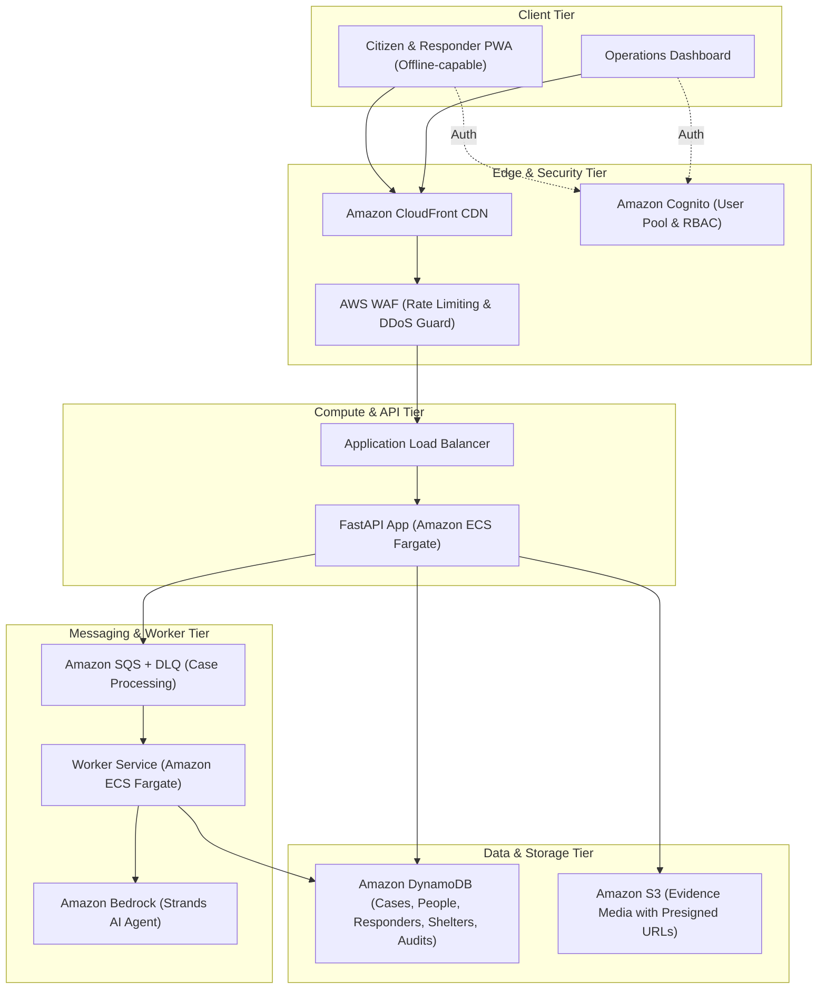

# Product Requirements Document (PRD): ReliefOS

**Document Version:** 1.0.0  
**Status:** Approved / MVP Active  
**Author / Creator:** Chandrachood Raveendran ([chandrachood.in](https://chandrachood.in) | [LinkedIn](https://www.linkedin.com/in/chandrachoodraveendran))  
**Target Platform:** Amazon Web Services (AWS)  
**Classification:** Open-Source Disaster Response Coordination Platform  

---

## 1. Executive Summary & Product Vision

### 1.1 Problem Statement
During natural disasters and humanitarian crises (floods, cyclones, earthquakes, landslides), official emergency dispatch channels (e.g., 911/112 helplines) face severe bandwidth saturation, dropped calls, and fragmented situational intelligence. Citizens struggle to report life-critical emergencies, rescue teams lack structured geolocation and capability matching, and families are unable to locate missing persons without compromising victim privacy.

### 1.2 Product Vision
**ReliefOS** is an open-source, cloud-native, AI-assisted disaster reporting and rescue coordination operating system built on AWS. It bridges citizens, verified volunteer responders, and government incident command centers through an offline-resilient Progressive Web App (PWA) and an asynchronous, safety-bounded backend.

### 1.3 Core Tenets
1. **Human Authority First:** AI assists and summarizes; it never has the autonomous authority to dispatch resources, reject appeals, downgrade priority, or confirm fatalities.
2. **Deterministic Safety Baseline:** Critical triage logic (P0–P4) is deterministic code and functions 100% reliably even when AI services or external networks are offline.
3. **Privacy by Design:** Public missing person queries omit exact coordinates, phone numbers, notes, and sensitive recovery imagery.
4. **Resilience Under Constraint:** Idempotent submission handles erratic cellular networks; background workers decouple ingestion from media processing.

---

## 2. System Architecture & AWS Tech Stack

### AWS Stack Components:
- **Compute:** AWS ECS Fargate (Containerized FastAPI API + Asynchronous Worker)
- **Database:** Amazon DynamoDB (Single-digit ms operational state with TTL & In-Memory fallback for local dev)
- **AI & LLM:** Amazon Bedrock (Foundation models via Strands Agents framework with Guardrails)
- **Object Storage:** Amazon S3 (Encrypted evidence storage with presigned PUT/GET URLs)
- **Messaging:** Amazon SQS + Dead-Letter Queue (DLQ) for asynchronous triage enrichment
- **Authentication & RBAC:** Amazon Cognito User Pools (JWT/RS256 validation)
- **Infrastructure as Code (IaC):** AWS Cloud Development Kit (CDK v2 in Python)

---

## 3. Feature Matrix: Implemented MVP vs. Backlog Roadmap

| Feature Area | Feature Description | Status | Implementation Details |
| :--- | :--- | :--- | :--- |
| **Emergency Reporting** | Mobile-First Offline PWA | ✅ **Implemented (MVP)** | Service worker, IndexedDB report queue, installable manifest |
| **Emergency Reporting** | Idempotent Submission | ✅ **Implemented (MVP)** | `Idempotency-Key` header with deduplication in storage layer |
| **Emergency Reporting** | GPS & Multi-hazard Tagging | ✅ **Implemented (MVP)** | Geolocation API, danger indicators, structured assistance types |
| **Emergency Reporting** | HMAC Case Access Tokens | ✅ **Implemented (MVP)** | Time-decaying HMAC-SHA256 tokens for privacy-preserving reporter lookup |
| **Triage Engine** | Deterministic Safety Triage | ✅ **Implemented (MVP)** | P0–P4 rule engine evaluating keywords, trapped status, medical threats |
| **Triage Engine** | Bedrock AI Triage Enrichment | ✅ **Implemented (MVP)** | Strands Agent on Bedrock; JSON-schema validation, non-downgrade policy |
| **Media Handling** | Presigned S3 Evidence Upload | ✅ **Implemented (MVP)** | S3 presigned URLs for photos/videos/audio with strict byte bounds |
| **Family Assistance** | Privacy-Safe Person Search | ✅ **Implemented (MVP)** | Missing/Safe person registry; masks phone numbers, GPS, and notes |
| **Shelter Directory** | Proximity Search & Directory | ✅ **Implemented (MVP)** | Haversine distance calculations over DynamoDB coordinate cells |
| **Rescue Operations** | Responder Verification & Missions | ✅ **Implemented (MVP)** | Volunteer registration, coordinator approval, capability assignment |
| **Incident Command** | Operations Live Dashboard | ✅ **Implemented (MVP)** | Case filtering, Leaflet map geocoding, operational metric cards |
| **Security & Auth** | Dual Auth & RBAC Engine | ✅ **Implemented (MVP)** | `local` dev role headers & `cognito` JWT verification with role validation |
| **Audit & Governance** | Immutable Audit Trail | ✅ **Implemented (MVP)** | Case state transitions and responder mission assignment logging |
| **Infrastructure** | AWS CDK Automated Deployment | ✅ **Implemented (MVP)** | Complete VPC, ALB, ECS, SQS, S3, Cognito, DDB synth & deploy stack |
| **Mapping & GIS** | Amazon Location Service & GIS | 📋 **Backlog (Post-MVP)** | Route safety verification, live road-closure & flood polygons |
| **Multi-Channel** | SMS / IVR Two-Way Reporting | 📋 **Backlog (Post-MVP)** | AWS End User Messaging (Pinpoint/SNS) for low-connectivity devices |
| **Edge & Mesh** | LoRaWAN / Satellite Sync | 📋 **Backlog (Post-MVP)** | AWS IoT Core for LoRaWAN & off-grid mesh network synchronizers |
| **Multi-Modal AI** | Satellite / Drone Vision Analysis | 📋 **Backlog (Post-MVP)** | Multi-modal Bedrock & Rekognition for damage / flood boundary detection |
| **Voice / Speech** | Multilingual Voice Triage | 📋 **Backlog (Post-MVP)** | Amazon Transcribe + Amazon Translate for real-time vernacular audio |
| **Interoperability** | CAP / Emergency Agency Ingestion | 📋 **Backlog (Post-MVP)** | Common Alerting Protocol (CAP) ingestion and NDMA/FEMA CAD integration |
| **Enterprise Scale** | Global Tables & Multi-Region DR | 📋 **Backlog (Post-MVP)** | DynamoDB Global Tables, Route 53 Active-Active multi-region failover |

---

## 4. Deep Dive: Implemented MVP Features (v0.1.0)

### 4.1 Citizen Emergency Reporting
- **PWA & Offline Queue:** Allows users in disaster zones with intermittent cellular connectivity to draft and queue emergency reports locally.
- **Idempotency Guarantee:** Network retries pass an `Idempotency-Key` header. If a report with the same idempotency key is already in DynamoDB/memory, the system returns the existing case record without creating duplicate operational tickets.
- **Access Tokens:** To avoid forcing distressed citizens to register full user accounts during an emergency, the system issues a cryptographically signed HMAC token (`case:case_id:timestamp:salt`). The citizen can use this token to track progress, add updates, or cancel requests without exposing case details to the general public.

### 4.2 Multi-Tier Safety Triage Engine
- **Deterministic Baseline (P0 - P4):**
  - **P0 (Life-Critical):** Unconscious victims, inability to breathe, active structural collapse, rapidly rising water with trapped individuals.
  - **P1 (High Danger):** Severe bleeding, isolated medical emergencies, active fires without shelter.
  - **P2 (Moderate):** Stranded without immediate life threat, vulnerable elderly/infants needing evacuation.
  - **P3 (Standard):** Food/water/clothing requests, non-urgent logistics.
  - **P4 (Low):** General informational inquiries.
- **Asynchronous Bedrock AI Enrichment:**
  - Evaluates unstructured situational text and evidence metadata.
  - Generates structured triage summaries and flags operational hazards.
  - **Guardrail Rule:** AI is strictly additive; it can escalate priority (e.g., P2 &rarr; P1) based on context, but is programmatically prohibited from downgrading priority or rejecting cases.

### 4.3 Missing & Safe Person Registry
- Protects victim dignity and safety during chaotic disaster scenarios.
- Public search outputs only non-sensitive attributes: `full_name`, `status` (safe, missing, at_shelter, etc.), `approximate_age`, and `last_confirmed_area`.
- Phone numbers, physical coordinates, and field notes are strictly restricted to verified coordinators.

### 4.4 Verified Responder & Shelter Coordination
- **Responders:** Capabilities-based matching (`boat`, `medical`, `rope_rescue`, `heavy_vehicle`). Must be vetted and approved by incident coordinators before receiving mission assignments.
- **Shelters:** Provides capacity, occupancy, medical capability, and contact info, queryable by geographic radius.

---

## 5. Post-MVP Roadmap & Backlog (Future Releases)

### Phase 2: Enhanced Geospatial & Multi-Channel Communications (Q3-Q4)
1. **Amazon Location Service Integration:**
   - Real-time hazard routing avoiding confirmed flooded bridges, mudslides, and power-line hazards.
   - Dynamic geofenced evacuation alerts.
2. **Two-Way SMS & WhatsApp / IVR Gateway (Amazon Pinpoint / AWS End User Messaging):**
   - Enables citizens without smartphones or mobile data to report emergencies via structured SMS or automated voice prompts in local languages (e.g., Malayalam, Hindi, Tamil).
3. **Offline Field Responder Mobile App:**
   - SQLite-backed sync engine using AWS AppSync with offline-first GraphQL caching for rescue boats and ground teams.

### Phase 3: Multi-Modal AI & Aerial Intelligence (Future)
1. **Drone & Satellite Imagery Damage Assessment:**
   - Integration with Amazon Bedrock Multi-modal (Claude 3.5 Sonnet / Amazon Nova) and Amazon Rekognition to classify aerial footage, detect submerged vehicles, and estimate flood boundaries.
2. **Automated Vernacular Speech-to-Text:**
   - Real-time processing of emergency 911/112 audio calls via Amazon Transcribe with dialect handling and automated translation into English/Hindi for national dispatchers.

### Phase 4: National Incident Management Interoperability
1. **CAP (Common Alerting Protocol) Gateway:**
   - Automated ingestion of meteorological alerts from IMD, NOAA, and regional disaster management agencies.
2. **CAD (Computer-Aided Dispatch) Export:**
   - Standardized REST / Webhook integrations into existing police, fire, and ambulance dispatch systems.

---

## 6. Non-Functional Requirements & Production Readiness

### 6.1 Performance & Scalability
- **API Latency:** Case submission synchronous response `< 250ms` (p95) on DynamoDB.
- **Throughput:** Autoscaling ECS Fargate tasks capable of absorbing surge traffic up to 10,000 requests/minute.
- **Worker Concurrency:** SQS batching and auto-scaling workers to process Bedrock triage in `< 3 seconds` per case.

### 6.2 Security & Compliance
- **Zero Secrets in Code:** Configuration managed via environment variables and AWS Secrets Manager.
- **Encryption:**
  - In-transit: TLS 1.3 across CloudFront, ALB, and internal VPC communication.
  - At-rest: AWS KMS customer-managed encryption across DynamoDB, S3, and SQS.
- **RBAC Roles:** Strict separation of duties between `citizen`, `responder`, `medical`, `shelter_operator`, `coordinator`, and `recovery_officer`.

### 6.3 Reliability & Disaster Recovery
- **Multi-AZ Architecture:** Spread across minimum 2 Availability Zones.
- **DynamoDB Point-in-Time Recovery (PITR):** Continuous backup with 35-day retention.
- **Chaos Resilience:** Complete functionality of critical triage endpoints even during total Bedrock model throttling or outage.

---

## 7. Author & Maintainer Information

**ReliefOS** was conceived and architected as an open-source disaster response operating system.

- **Creator / Architect:** Chandrachood Raveendran
- **Website:** [chandrachood.in](https://chandrachood.in)
- **LinkedIn:** [linkedin.com/in/chandrachoodraveendran](https://www.linkedin.com/in/chandrachoodraveendran)
- **GitHub Repository:** [https://github.com/chandrachood/ReliefOS.git](https://github.com/chandrachood/ReliefOS.git)
- **License:** [Apache License 2.0](https://github.com/chandrachood/ReliefOS/blob/main/LICENSE)
